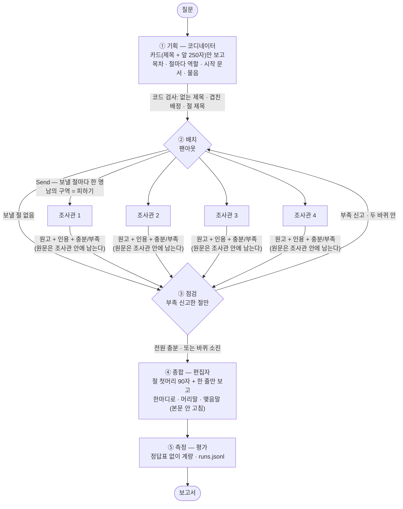

# 딥리서처 에이전트 — 어르신 건강 보고서 작성기

질문 하나를 넣으면 코디네이터가 목차를 짜고, 조사관 넷이 자료를 나눠 읽어 각자 한 절씩 쓰고,
편집자가 이어 붙여 장문 보고서를 만든다. 그리고 **정답표 없이 재고, 장치를 하나씩 꺼서** 무엇이 값을 했는지 가린다.

> 의학적 진단·처방이 아니다. 한국어 위키백과 질환 문서와 법령을 정리한 것이다.

| 항목 | 값 |
|---|---|
| 코퍼스 | 위키백과 57건 (R0) · + 법령 6건 = 63건 (확장) |
| 질문 | 20건 — 한 건으로 답 4 · 여러 갈래 8 · 한 대상 추적 8 |
| 실험 | 보고서 88편 (6질문 × 7설정(R0 기본 포함) × 2회차 = 84 + 경로시험 4) |
| 데모 | `python app.py` → http://127.0.0.1:8000 · 공개 주소 senior.dodami-ai.com (필요할 때만 켬) |

본문 1~6항목은 과제 가이드 순서를 따른다. 만드는 동안의 관찰 · 확인 기록 · 판단은 **부록 A~I** 에 있다.

---

## 1. 주제와 코퍼스

### 무엇을 왜 골랐나

**어르신과 보호자가 묻는 건강 질문.** 작성자는 어르신용 LINE 챗봇을 만들어 온 사람이다.
어르신 질문은 한 가지 병으로 끝나지 않는다 — *"핸드폰을 어디 두셨는지 깜빡하시는데 치매인가요?"* 는 치매 · 알츠하이머병 ·
섬망 · 우울을 나란히 놓아야 가려진다. 한 문서로 답이 안 나오는 질문이 자연스럽게 많다.

과제 「주제 고르기」 네 조건과 대조했다.

| 조건 | 이 코퍼스 |
|---|---|
| 한 질문에 여러 자료가 필요하다 | 질문 20건 중 16건이 여러 갈래 · 한 대상 추적 |
| 자료 전체가 모델 창에 안 들어간다 | R0 **559,634자 = 창의 2.19배** (2자 = 1토큰, 창 128,000 토큰) |
| 자료끼리 서로를 가리킨다 | 위키백과 내부 링크 — 문서당 중앙값 **7** |
| 산출물이 장문이다 | 4절 보고서 · 절마다 300~600자 |

### 코퍼스 두 가지

| | R0 `data/corpus.json` | 확장 `data/corpus_full.json` |
|---|---|---|
| 자료 | 한국어 위키백과 질환 문서 **57건** | 위 57건 + **법령 6건** = **63건** |
| 총 글자 | 559,634자 (창 2.19배) | 719,019자 (창 2.81배) |
| 링크 중앙값 | 7 | 6 |
| 아무도 가리키지 않는 문서 | **«대상포진»** — 탐색으로는 영영 못 닿는다. 배정이 유일한 경로 | 같음 |

- **모은 방법** — `tools/collect_corpus.py` 가 위키백과 API 로 시드 문서에서 2홉까지 넓힌 뒤, 이미 뽑은 문서와
  **링크로 촘촘히 이어진 것부터** 골랐다. 길이 순으로 고르면 「언어」 「미국」 같은 큰 일반 문서가 딸려와 링크가 희박해졌다.
  `prop=extracts` 는 요청이 많으면 429 로 막혀, 후보 훑기는 `action=raw`, 최종 선택분만 `extracts` 로 받았다.
- **법령을 넣은 이유** — 어르신이 끝에 묻는 건 *"그래서 무엇을 할 수 있나"* 인데 위키백과엔 그 자료가 없다.
  모델이 그 자리를 상식으로 메우다 원문에 없는 조언을 보탰다 (부록 A-4). 국가법령정보 OPEN API 로
  치매관리법 · 노인장기요양보험법 · 노인복지법 등 6건을 받았다 (`tools/collect_laws.py`).

### 질문 세트 — `data/questions.json`

| 성격 | 건수 | 예 |
|---|---|---|
| 한 건으로 답 | 4 | 등에 띠처럼 물집이 났는데 뭘까요? (← «대상포진», 배정 없이는 못 닿음) |
| 여러 갈래 | 8 | 어머님이 화를 자주 내시고 감정의 기복이 심하신데 어떤 노인성 질환인가요? |
| 한 대상 추적 | 8 | 어머니가 당뇨인데 눈이 침침하대요. 관계가 있나요? |

- **정답표는 만들지 않았다.** 질문마다 「이건 왜 나눌 만한가」 를 한 줄씩 적었다
- **한 건으로 답이 나오는 질문을 일부러 넣었다** — 이 구조를 쓰면 안 되는 경우를 보이기 위해
- **20건 중 15건은 작성자가 직접 쓰거나 고쳤다** (처음부터 4 · 초안을 고쳐 씀 11). 말투만 바꾼 쌍도 하나 넣었다
- 질문이 가리키는 문서가 코퍼스에 있는지, 한 대상 추적 질문의 경로가 2홉 안에 이어지는지 `tools/check_questions.py` 로 대조했다

---

## 2. 분업 설계

### 목차의 축 — 질환별 (작성자 결정)

**절 하나 = 질환 문서 하나.** 처음엔 한 질환을 증상 · 원인 · 진단 · 치료로 나눴는데, 결과물을 읽어 보니 **네 절이 거의 같은
말로 수렴했다** (부록 A-6). 그래서 절을 문서 단위로 갈랐다. 법령 절은 법령 문서 하나다. 부록에서는 같은 뜻으로 「자료별」 이라고 적었다.

### 역할 명단 — 코퍼스에서 세어 뽑았다 (작성자 결정)

| 역할 | 근거 (코퍼스 문서의 절 제목을 센 수) | 무엇을 찾아 읽나 |
|---|---|---|
| 증상 담당 | 19건 | 어떤 증상이 어떻게 나타나는가 |
| 원인 담당 | 26건 | 왜 생기는가 · 무엇이 위험을 높이는가 |
| 진단 담당 | 23건 | 어떻게 가려내는가 · 무엇과 헷갈리는가 |
| 치료 담당 | 25건 | 어떻게 치료하고 관리하는가 |
| 제도 담당 | 법령 6건 | 무엇을 신청할 수 있고 어떤 지원을 받는가 |

- 처음 명단의 「생활·돌봄 담당」 은 **코퍼스에 그 절이 0건**이라 뺐다 — 자료가 없는 역할을 주면 인용 0곳으로 절을 쓴다
- 역할은 **절 제목이 아니라 그 절을 읽는 각도**다. 역할에 따라 `read_one` 이 원문에서 찾는 것이 달라진다
- 명단은 5개, 절수는 4 — 명단은 「고를 수 있는 것」, 절수는 「몇 개 고르나」. 같은 역할이 두 번 나와도 된다

### 규칙 — `config.json`

| 값 | 설정 | 뜻 |
|---|---|---|
| 절수 | 4 | 조사관 넷을 동시에 보낸다 |
| 절예산 | 3 | 조사관 한 명이 한 바퀴에 읽는 문서 수 (배정 1 + 스스로 고른 2) |
| 바퀴 상한 | 2 | 부족 신고가 나와도 두 바퀴에서 멈춘다 |
| 카드 | 앞 250자 | 코디네이터가 보는 것은 문서 제목과 앞 250자뿐 |
| 메모 | 300자 | 조사관이 문서 한 건을 읽고 남기는 메모 |
| 편집자 | 절 첫머리 90자 | 편집자는 절 본문 전체를 보지 않는다 |

### 흐름

1. **배정** — 코디네이터가 카드만 보고 절마다 **역할 · 시작 문서 · 물음(지시)** 을 정한다.
   **배정이 실제 자료를 가리키는지 코드가 검사한다** — 없는 제목 · 두 절에 같은 문서 · 코퍼스에 없는 절 제목은 코드가 고치고 `고침` 에 남긴다.
   **예산**은 절마다 3건을 코드가 준다 (`for _ in range(t["예산"])` — 모델이 어길 수 없다). 3은 수업 기준선 값이고,
   4건으로 늘려도 근거율 · 절 길이가 늘지 않았고(부록 G) 1건으로 줄여도 조사관 전원이 「충분」 이라 신고했다(부록 I)
2. **구역** — 조사관을 보낼 때 **남의 시작 문서를 「피하기」 로** 준다. 두 번째 바퀴엔 이미 읽힌 문서 전부를 피한다
3. **조사** — 조사관은 원문을 읽고 메모만 남긴다(원문이 위로 안 올라간다). 읽은 문서의 링크에서 **후보를 스스로 골라** 예산만큼 읽는다.
   관련이 없으면 「관련 없음」 이라고만 답할 탈출구를 뒀다. 끝나면 원고 · 인용 · 「충분/부족」 자기신고를 올린다
4. **점검** — **부족하다고 신고한 절만** 다시 보낸다. 바퀴 상한 2
5. **종합** — 편집자는 절을 **이어 붙이기만** 하고 본문은 다시 쓰지 않는다. 다시 쓰면 인용이 장식이 된다.
   어르신이 읽을 「한마디로」 를 앞에 붙이고, 그 근거가 어느 절인지는 코드가 붙인다

### 격리는 숫자로 — 코디네이터가 본 글자 ÷ 조사관이 읽은 글자

`코디글자` 와 `읽은글자` 를 상태에 따로 더한다. 첫 성공 실행에서 **12.1%** (15,046자 / 124,465자), 이후 실험 내내 **8~12%**.
코디네이터 글자의 대부분은 카드다.

### 두 번째 원고 — 인용이 촘촘한 쪽을 남긴다

무조건 덮어쓰면 **인용을 빠뜨린 두 번째 원고가 멀쩡한 첫 원고를 지운다.** 두 원고 중 문장당 인용이 많은 쪽을 남긴다.
가짜 응답기로 「1바퀴는 멀쩡 · 2바퀴는 인용 빠뜨림」 을 만들어 견주니, 인용밀도는 멀쩡한 절 4편을 지켰고
덮어쓰기는 4편 모두 인용 빠진 원고로 바뀌었다 (부록 C-3). **실제 실행에서는 재위임이 한 번도 돌지 않아** 이 코드가 탄 적은 없다 (부록 I).

### 결과물을 읽고 바꾼 설계 — 전부 작성자가 짚은 것

| 바꾼 것 | 계기 (작성자가 결과물을 읽고 한 말) |
|---|---|
| 목차 축: 측면별 → 질환별 | 「네 절이 같은 말을 한다」 |
| 역할 「한 번씩만」 제약 제거 | 과제에도 수업에도 없던 제약이었다 |
| 조사관이 후보를 고르게 함 (`다음문서`) | 「고혈압은 왜 들어간거야?」 — 가나다순으로 읽고 있었다 |
| 법령 6건 + 제도 담당 | 「그래서 뭘 해야 하는지」 |
| 역할별 읽기 (`read_one`) | 「실제적인 도움이 되나?」 |
| 절마다 다른 물음 (`지시`) | 「지금 해결할 수 없는 문제냐?」 |
| 「한마디로」 + 근거는 코드가 붙임 | 「보호자가 듣고 어르신은 쉽게」 |
| 절 제목도 코퍼스에 있는지 검사 | 첫 실행 기록에서 발견 |

**지표는 이 중 하나도 잡지 못했다.** 격리율은 내내 8~12% 였다.

---

## 3. 지표 — `metrics.py`

정답표도 판정 모델도 쓰지 않는다. **만들어진 글과 실제로 읽은 자료만** 본다. 지표마다 **어느 장치를 먼저 의심할지** 정해 뒀다 —
결과물이 마음에 안 들 때 어디를 고칠지 알기 위해서다. `python metrics.py --지표표` 로 같은 표가 나온다.

### 신호 — 높낮이를 견준다

| 지표 | 한 줄 설명 | 먼저 의심할 장치 |
|---|---|---|
| 근거율 | 인용이 붙은 문장 ÷ 전체 문장 | 조사 — 원고에 인용을 붙였나 |
| 격리율 | 코디네이터가 본 글자 ÷ 조사관이 읽은 글자 | 격리 — 원문이 코디네이터 창으로 올라갔나 |
| 중복률 | 두 절 이상이 읽은 문서 ÷ 읽은 문서 | 구역 — 피하기 목록이 제 일을 하나 |
| 절겹침률 | 다른 절과 4어절 이상 똑같은 문장 ÷ 전체 문장 | 기획 — 절마다 다른 물음을 줬나 |
| 편중 | 인용 1위 문서 ÷ 전체 인용 | 배치(폭) — 절이 넓어 두꺼운 문서 하나에 기댄다 |
| 절당읽기 | 절마다 읽은 문서 수의 평균 | 배치(깊이) — 예산이 모자라거나 남는다 |
| 절당글자 | 절 본문 글자 수의 평균 | 배치(깊이) — 읽은 자료가 모자라 쓸 게 없다 |
| 고침수 | 코드가 기획 JSON 을 고친 횟수 | 기획 — 모델이 없는 제목 · 겹친 배정을 지어냈다 |

### 경보 — 0이어야 한다

| 지표 | 한 줄 설명 | 먼저 의심할 장치 |
|---|---|---|
| 인용0곳절 | 인용이 하나도 없는 절 수 | 조사 — 원고가 인용을 안 붙였다 |
| 허위인용 | 안 읽은 문서를 인용한 수 | 조사 — 원고가 메모 밖 이름을 끌어왔다 |
| 한마디로근거0 | 「한마디로」 의 근거가 비었나 | 종합 — 편집자가 근거 칸을 비웠다 |
| 한마디로빗나감 | 「한마디로」 근거가 절 제목이 아닌 수 | 종합 — 편집자가 없는 절을 댔다 |
| 기획파싱실패 | 기획 JSON 을 통째로 못 받았나 | 기획 — 모델이 JSON 문법을 깼다 |

### 버림 — 측정 전에 정한 규칙대로

「4단계 전체에서 한 번도 안 움직인 신호는 버린다」 를 **측정 전에** 정했다. **빈손율** 과 **재위임절수** 가 88편 내내 0이라
버렸다. 계산은 남겨 기록에 계속 쌓는다 (부록 I-2).

- 문장을 세는 규칙은 `metrics.문장나누기` **한 곳**에 둔다. 한 곳 더 숨어 있던 것을 찾아 합쳤다 (부록 C-4)
- 지표는 명백한 실패를 거르는 데만 쓰고 **순위표로 쓰지 않는다.** 어느 쪽이 나은지는 나란히 놓고 읽어서 정했다 (부록 H)

### 전 → 후 — 바꾸니 숫자가 어떻게 달라졌나

| 바꾼 것 | 전 | 후 | 부록 |
|---|---|---|---|
| 절 제목도 코퍼스에 있는지 코드가 검사 | 근거율 **0.0%** (R0 첫 기록 실행) | **51.9%** | A-11 |
| 절 제목이 겹치면 원고가 합쳐지던 버그를 고침 | 목차는 4절인데 보고서에 실린 절 **1편** | 고친 뒤 2회차 42편 모두 절 수 이상 없음 | F |
| 배정 · 구역 (켠 것 → 끈 것) | — | 끄면 중복률이 오른 경우 12번 중 **9번**(배정) · **10번**(구역) | G-4 ① |
| 목차 축 측면별 → 질환별 · 조사원이 후보를 고름 | 격리율 12.1% · 인용 0곳 절 0 | 11.6% · 1 — **숫자는 거의 그대로, 글이 달라졌다** | A-9 |

마지막 줄이 이 프로젝트의 요점이다. 가장 큰 설계 변경은 숫자로 드러나지 않았고, 읽어서 알았다.

### 지표 다음 — 결과물을 직접 비교했다 (작성자)

과제 4단계 네 줄은 **작성자가 직접** 했다. 판단 문장은 부록에 작성자가 준 그대로 있다.

| 과제 4단계 | 부록 | 작성자가 한 일 |
|---|---|---|
| 보고서 여러 편 — 기본 · 장치 하나 끈 것 · 혼자 | E · G | 예측을 확인한 뒤 돌림 · 2회차 결정 · 판정 확정 |
| 대조군 — 같은 자료 · 모델 · 도구 · 읽기 예산 | D | 맞춘 것 승인 · 「공정하다」 판단 |
| 나란히 놓고 직접 읽기 | H-1 · H-2 · H-4 · H-6 | 어느 쪽이 나은지와 그 이유 |
| 어느 절 · 어느 자료에서 비롯됐나 | H-5 | 기획 · 코드 대체 · 조사관으로 나눠 짚음 |
| 인용을 원문과 대조 | H-3 · H-6 | 인용 4곳을 한 문장씩 판정 |

---

## 4. 파이프라인 구조도

**왜 이 구조인가** — 자료가 모델 창의 **2.19배**(R0) ~ **2.81배**(확장)라 한 모델이 다 읽을 수 없다. 그래서 목차를 짜는
코디네이터는 카드(제목 + 앞 250자)만 보고, 원문은 조사원들이 나눠 읽어 메모와 원고만 위로 올린다. 코디네이터가 본 글자는
조사원이 읽은 글자의 8~12% 다. 조사원끼리는 서로 기다릴 일이 없어서 `Send` 로 동시에 보낸다.



**과제 원문 단계 ↔ 코드 노드** (`graph.py`)

| 과제 원문 | 코드 노드 | 하는 일 |
|---|---|---|
| ① 기획 | `기획` | 목차 · 역할 · 시작 문서 · 물음. 배정 검사 |
| ② 배치 | `배치` → `팬아웃` → `조사` × N | `Send` 로 조사관을 동시에 보낸다. 조사관은 예산만큼 읽고 자기 절을 쓴다 |
| ③ 점검 | `점검` → `루프` | 부족 신고한 절만 다시 `배치` 로. 없으면 `종합` 으로 |
| ④ 종합 | `종합` | 이어 붙이고 앞뒤 글만 쓴다 |
| ⑤ 측정 | `평가` (`metrics.py`) · `ablation.py` · `baseline.py` | 계량 · 스위치를 하나씩 끈 실험 · 혼자 하는 대조군 |

**상태 (`상태` TypedDict)**

| 칸 | 뜻 | 합치는 방식 |
|---|---|---|
| `질문` · `목차` · `보내기` · `바퀴` | 질문, 코디네이터가 짠 목차, 이번 바퀴에 보낼 절 번호, 바퀴 수 | 덮어씀 |
| `sections` | 조사관이 올린 원고 (재위임분이 쌓인다) | **더함** (`operator.add`) |
| `코디글자` · `읽은글자` | 격리율의 분자 · 분모 | **더함** |
| `로그` | 진행 기록 | **더함** |
| `종료` | 왜 멈췄나 — 「충분」 / 「예산」 | 덮어씀 |
| `고침` | 코드가 모델의 배정을 고친 내역 | 덮어씀 |

조사관 넷이 동시에 원고를 올리므로 `sections` 와 글자 수는 **더하는 방식**으로 모은다. 덮어쓰면 서로 지운다.

**멈추는 장치 — 폭주 · 과금 · 이상한 입력**

| 장치 | 값 | 어디 |
|---|---|---|
| 그래프 한 번의 단계 상한 | `recursion_limit` 50 | `graph.py` |
| 다시 보내기(재위임) 상한 | 2바퀴 | `config.json` 바퀴상한 |
| AI 호출 타임아웃 · 재시도 | 60초 · 0번 | `config.json` 모델 |
| 누적 비용 차단기 | $5 — 넘으면 AI 를 **부르기 전에** 멈춤 | `tools/cost.py` |
| 라이브 한 번 상한 · 동시 실행 | 약 $0.07 · 한 번에 한 명 | `app.py` |
| 모델 JSON 이 깨지면 | JSON 부분만 떼어 냄 → 그래도 실패하면 기본값으로 (멈추지 않음) | `graph.py` |
| 배정 검사 | 없는 제목 · 두 절에 같은 문서 · 코퍼스에 없는 절 제목을 코드가 고치고 `고침` 에 기록 | `graph.py` |
| 관련 없는 문서 | 조사관이 「관련 없음」 만 답하게 하는 탈출구 | `config.json` 조사관 |
| 이상한 입력 | 질문 5~300자 · 키 모양 검사 · 키 없으면 400 | `app.py` |

---

## 5. 데모 설계

`python app.py` → http://127.0.0.1:8000 (FastAPI + HTML 한 장 · `app.py` · `static/index.html`)

과제가 요구한 것은 **"보고서와 함께 누가 무엇을 읽고 무엇을 썼는지"** 다. 그래서 화면 가운데에는 지표가 아니라 **조사원 넷의 한 줄씩**이 있다.
누르면 **읽은 자료 → 문서마다 남긴 메모 → 쓴 글 → 원문 대목** 순서로 펼쳐진다.

### 세 쪽 — 한 쪽에 한 가지 일

| 쪽 | 하는 일 |
|---|---|
| ① 질문 고르기 | 지난 실험 질문 6개(키 없이 · 0원) + **직접 물어보기**(내 키) |
| ② 회의실 | 팀장과 조사원 넷이 나누기 → 찾아 읽기 → 모아 정리하는 모습이 진행 기록과 함께 움직인다 |
| ③ 결과 | 「한마디로」 를 크게 · 사람별 줄 · 보고서 · 다르게 돌린 것과 비교 · 숫자(접힘) |

| ① 질문 고르기 | ② 회의실 | ③ 결과 |
|---|---|---|
|  |  |  |

### 신경 쓴 부분

- **작성자가 직접 만든 회의실 방식** — 작성자가 먼저 만들어 둔 AI 회의실(원형 초상 · 역할 · 상태 알약 · 진행 기록)을 그대로 따랐다
- **누구나 알게 쉬운 말** — 코디네이터 → 팀장, 조사관 → 조사원, 절 → 주제, 인용 → 출처. 과제 용어는 「자세히」 안에 괄호로
- **번잡하지 않게** — 색은 상태 알약에만 (읽는 중 · 끝 · 출처 없음). 비교 설정 8개는 접어 뒀다
- **소리** — 결과의 「한마디로」 를 🔊 로 읽어 준다(edge-tts). 질문은 🎤 로 말해서 넣을 수 있다(브라우저 음성 인식).
  읽어 주는 글은 기록 번호로만 받는다 — 공개 주소에서 아무 글이나 읽히는 길을 막는다. 말한 질문은 칸에 들어갈 뿐, 물어보기는 직접 누른다
- **인용을 원문과 대조** — 출처를 누르면 원문에서 가장 가까운 대목이 나온다. 인용 없는 문장은 회색
- **키는 방문자 것만** — 서버는 작성자 키(`.env`)를 절대 쓰지 않는다. `app.py` 가 뜰 때 환경에서 지우고, 사용자 키는 요청 머리로만 받는다.
  키는 저장하지 않는다. 라이브 1회 상한 약 100원 · 한 번에 한 명
- **공개** — senior.dodami-ai.com (Cloudflare Tunnel). 필요할 때만 켠다. 공개 전에 `.env` · 소스 · 기록 파일이 밖에서 안 열리는지,
  키 없는 라이브 요청이 거절되는지 확인했다

---

## 6. 프로젝트 회고

### 가장 공들인 부분

**1. 숫자보다 결과물을 먼저 읽었다.** 2장의 「결과물을 읽고 바꾼 설계」 8개는 모두 작성자가 보고서를 읽다가 짚은 것이다.
그동안 지표는 하나도 경보를 울리지 않았다 — 격리율은 내내 8~12% 였다. 본실행 1회차에서 절 원고가 조용히
버려지는 버그(부록 F)도 지표가 아니라 로그의 절 수가 4가 아닌 줄에서 드러났다. 지표는 명백한 실패를 거르는 데까지만
쓰고, 어느 쪽이 나은지는 나란히 놓고 읽어서 정했다 (부록 H).

**2. 재는 도구부터 의심했다.** 문장을 세는 규칙이 한 곳 더 숨어 있던 것을 찾아 합쳤고(부록 C-4), 스위치는 끈 것만이
아니라 켠 것과 같이 돌려 정말 멈추는지 봤다(부록 C-2). 대조군은 같은 자료 · 모델 · 도구 · 읽기 예산을 주고 예산을
끝까지 쓰는지 확인한 뒤에야 견줬다(부록 D). 4-C 는 모든 설정을 두 회차씩 돌렸는데, 기본 설정끼리도 근거율이 회차마다 평균 19.9%p 흔들렸다(부록 G-2).
그래서 한 번 돌린 결과로 단정하지 않았다.

**3. 예측을 먼저 적고 쟀다.** 4-C 를 돌리기 전에 설정별 예측과 「맞았다」 의 기준을 적었고(부록 E),
틀린 예측도 고치지 않고 그대로 판정했다(부록 G).

**4. 읽는 사람을 둘로 봤다.** 판단해야 하는 보호자에게는 근거가 붙은 절 본문을, 읽고 이해하셔야 하는 어르신에게는
쉬운 말의 「한마디로」 를 줬다. 데모도 같은 생각으로 쉬운 말 · 한 쪽에 한 가지 일 · 🔊 듣기로 만들었다.

### 보완하고 싶은 점

- **인용 0곳 절** — 라이브 첫 실행에서도 4절 중 2절이 인용 없이 나왔다. 모델이 원문에 없는 말을 보태는 자리다 (부록 A-4 · A-8)
- **재위임이 한 번도 돌지 않았다** — 88편 내내 조사원이 전부 「충분」 이라 신고했다. 절예산을 1로 줄여도 같았다 (부록 I).
  부족한지를 모델의 자기 신고가 아니라 코드가 판단하는 방법이 필요하다
- **읽기 편한 글이 근거가 맞는 글은 아니었다** — 나란히 읽을 때 읽기 편한 쪽을 골랐더니, 근거가 틀린 문장이 걸러지지 않았다.
  인용 옆에 원문 대목을 놓았을 때는 걸렸다 (부록 H-6). 데모에서 출처를 누르면 원문 대목이 나오게 한 이유이고,
  다음에는 인용과 원문이 얼마나 겹치는지를 숫자로 먼저 보여 주고 싶다
- **절 길이가 목표 600자에 못 미친다** — 한 건 더 읽혀도 길어지지 않았다. 원고 지시(6~12문장) 때문일 수 있지만 확인하지 않았다 (부록 G)
- **법령이 수집 시점 그대로다** — 지자체 조례도 없다
- **데모** — 한 번 묻는 데 12~37초 · 키 화면의 「키 확인」 과 「넣기」 가 따로라 헷갈린다 · 공개 주소가 노트북에 매달려 있어 노트북이 꺼지면 안 열린다

---

## 부록 A. 만드는 동안 관찰된 것

> 실행 로그에서 눈에 띈 것을 발견 시점과 함께 적어 둔다.
> **판정은 여기서 하지 않는다.** 4단계 「결과물을 직접 비교하기」에서 작성자가 보고 정한다.

### A-1. 모델이 배정을 지어내거나 겹쳐 준다 (2-B, ① 기획)

코드 검증이 두 회차 모두 잡았다.

| 회차 | 모델이 준 것 | 코드가 한 일 |
|---|---|---|
| 1 | 네 절에 **전부 «당뇨병»** | 셋을 다른 문서로 바꿈 |
| 2 | «당뇨병» 이 두 절에 겹침 | 하나를 바꿈 |

프롬프트에 *「절끼리 시작문서가 겹치면 안 됩니다」* 라고 써 뒀는데도 어겼다.
**코드 검증이 없으면 조사관 넷이 같은 문서를 네 번 읽는다.**

### A-2. JSON 문법이 깨져 응답이 통째로 버려진다 (2-B, ① 기획)

닫는 괄호가 하나 더 붙어 파싱이 실패했다. 방어 3단이 작동해 터지지는 않았지만,
**돌아간 기본값이 나빴다** — 당뇨병 질문에 «암» 이 배정됐다.

상태에 `파싱실패` · `고침수` 를 남겨 ⑥ 평가의 계량에 싣는다.

### A-3. `temperature=0` 인데 회차마다 결과가 다르다 (2-B)

같은 질문(T1)을 같은 설정으로 돌렸는데 **1회차는 파싱 실패, 2회차는 성공**했다.
→ 지표를 비교할 때 **한 회차 결과로 단정하지 않는다.**

### A-4. 조사관이 원문에 없는 말을 보탠다 (2-C-1, ③ 조사)

질문 *「어머니가 당뇨인데 눈이 침침하대요. 관계가 있나요?」* 로 «당뇨병»(12,045자)을
읽혔더니 메모(193자)의 마지막 문장이 이랬다.

> 「따라서 전문의와 상담하여 적절한 검사를 받는 것이 중요합니다.」

원문을 대조했다.

| 낱말 | «당뇨병» 원문에 |
|---|---|
| 망막 · 시력 · 합병증 · 실명 | 있음 — 메모 본문은 원문에 근거함 |
| **전문의** | **0회** |
| **상담** | **0회** |

읽기 프롬프트에 *「원문에 없는 내용을 보태지 마십시오」* 라고 썼는데도 보탰다.

코디네이터는 원문을 본 적이 없으므로, 조사관이 **빠뜨린 것**을 복구할 수 없듯
**보탠 것**도 알아낼 수 없다.

→ 과제 4단계의 *「인용이 제자리에 붙었는지 원문과 대조한다.
읽지 않은 문서를 인용한 것은 코드가 잡지만, **읽은 문서를 엉뚱한 문장에 갖다 붙인 것은
사람이 잡는다**」* 에 해당한다. **그때 작성자가 보고 정한다.**

### A-5. 우리 질문 말투에서 탈출구가 과하게 발동했다 (2-C, ③ 조사) ★

첫 전체 실행에서 **읽은 13건이 전부 「관련 없음」** 으로 돌아왔다. «치매» 문서마저 그랬다.
그 결과 **인용 0곳인 절이 4개 중 4개** — 조사관들이 자료 없이 절을 썼다.

같은 문서를 질문만 바꿔 읽혀 원인을 가렸다.

| 질문 | 문서 | 메모 |
|---|---|---|
| 「치매의 **증상은 무엇인가요**?」 (사실 질문) | «치매» | **221자** |
| 「…깜빡하시는데 **치매인가요**?」 (개인 사례) | «치매» | **빈손** |

읽기 프롬프트가 *「이 질문에 **답하는** 데 쓸 내용만」* 이라고 했는데, 백과사전 문서는
「당신 어머님이 치매인가」에 답할 수 없다. 그래서 모델이 탈출구를 택했다.

**수업 코퍼스에서는 안 드러나는 고장이다.** 수업 질문은 역사적 사실을 묻는
질문이었다. 우리 평가셋은 20건 중 15건을 작성자가 **어르신 실제 말투**로 썼고,
대부분이 「우리 어머님이 …한데 …인가요?」 형태다.

**고친 것** — 탈출구 조건을 좁혔다. *「문서의 주제가 질문과 **아예 다를 때만** 관련 없음」*,
그리고 *「질문이 개인 사례를 묻더라도 판단에 쓰일 **일반적인 사실**을 추리면 된다」*.
탈출구 자체는 살아 있다 (같은 질문에 «DNA» 는 여전히 빈손).

고친 뒤: 인용 0곳 **4절 → 0절**, 허위 인용 0건.

### A-6. 첫 성공 실행에서 눈에 띈 것 — 작성자 확인 대기

보고서: `output/reports/` · 질문 M1 · 2026-09-23

1. **네 절이 거의 같은 말을 한다.** 넷 다 "핸드폰을 잊어버리는 것은 단순 건망증일 수도,
   치매 초기일 수도"로 수렴했다. 목차가 **측면별**(정의·원인·진단·치료)로 나뉘었는데
   프로젝트 결정은 **질환별**이었다
2. **4절 「치매 치료 및 관리」에 치료 내용이 없다.** 배정이 «주요 우울 장애» 였다
3. **인용 오귀속 의심** — 치매 증상 서술에 «섬망» · «뇌경색» · «고혈압» 이 붙은 대목이 있다
4. **인용 기호가 깨진 곳** — `«뇌경색”` (닫는 » 가 " 로). 코드는 이걸 인용으로 세지 않았다
5. **절 길이 315~490자** — 수업 기준 600자 미달

→ **판정은 하지 않았다.** 4단계에서 작성자가 원문과 대조해 정한다.

### A-7. 조사관이 후보를 고르지 않고 가나다순으로 읽고 있었다 (2-C) ★

작성자가 보고서를 읽다가 4절(배정 «주요 우울 장애»)에 **«고혈압»** 이 인용된 것을 짚었다.
치매 질문에 고혈압이 나올 이유가 없었다.

추적해 보니 원인이 코드에 있었다. 조사관이 예산 3건을 채울 때 두 번째·세 번째 문서를
**후보 목록의 맨 앞에서 집고** 있었다.

```python
후보 = 후보목록(누적, 피하기)
다음 = 후보[0]          # ← 판단 없음
```

`corpus.json` 의 링크가 정렬돼 있어, 결과적으로 **가나다순 첫 글자**를 읽었다.

```
«주요 우울 장애» 의 링크 :  고혈압 · 뇌경색 · 뇌졸중 · 당뇨병 · 두통 · 암 · 췌장암
조사관이 읽은 것         :  고혈압(ㄱ) → 뇌경색(ㄴ)
```

수업 3-K 는 조사관이 링크 후보 가운데 **스스로 하나를 골라** 이어 읽게 하고,
`read_one` 과 `다음문서` 를 **바깥 도구 둘**로 떼어 놓았다. 그중 `다음문서` 를 채우지 않아
탐색이 아니라 정렬 순서가 되어 있었다.

**한 원인이 여러 증상을 만들고 있었다**

| 증상 | 관계 |
|---|---|
| 치매 질문에 «고혈압»·«뇌경색» 이 섞임 | 후보를 고르지 않음 |
| 절 길이가 600자에 못 미침 | 읽은 3건 중 2건이 질문과 무관 → 쓸 재료가 없음 |
| 인용 오귀속 | 무관한 문서를 읽었는데 인용은 붙여야 하니 |

**고친 뒤** — `다음문서()` 를 조사관 바깥 도구로 만들어 후보를 LLM 이 고르게 했다.
받은 제목이 후보에 실제로 있는지는 코드가 검사한다(수업 3-E). 같은 질문으로 다시 돌렸다.

| 조사관 | 고치기 전 | 고친 뒤 |
|---|---|---|
| 증상 담당 | — | 파킨슨병 · 뇌졸중 |
| 원인 담당 | — | **노화** · 뇌 |
| 진단 담당 | — | **노화** · 뇌혈관 질환 |
| 치료 담당 | 고혈압 · 뇌경색 | 뇌졸중 · 뇌 |

«고혈압» 이 사라졌고, 질문 M1 의 `why_split` 이 지목한 **«노화»** 를 두 조사관이 골랐다.

### A-8. 근거 없는 의학 수치 — 실행마다 값이 바뀐다 ★★

A-7 을 고친 실행에서 **치료 담당 절의 인용이 0곳**으로 나왔다(경보). 그 절 원고를 읽어 보니
숫자가 하나 들어 있었고, 같은 문장이 직전 실행에도 있었는데 **숫자가 달랐다.**

| 실행 | 모델이 쓴 문장 | 원문 대조 |
|---|---|---|
| 앞 | 「치매는 … 증상들이 **2주 이상** 지속되어야 진단됩니다 «주요 우울 장애»」 | 2주는 **«주요 우울 장애»의 진단 기준**이다. 치매가 아니다 |
| 뒤 | 「치매는 … 증상들이 **6개월 이상** 지속되어야 진단됩니다」 | **어느 문서에도 없다** |

«치매» 문서에는 기간 숫자가 아예 없다 (`2주`·`6개월`·`개월`·`주 이상` 전부 0건).

```
앞 실행 : 원문에 있는 숫자를 엉뚱한 질환에 갖다 붙임   = 오귀속
뒤 실행 : 원문에 없는 숫자를 지어냄                  = 날조
```

**코드로는 뒤쪽을 못 잡는다.** 허위 인용 검사는 「인용한 문서를 실제로 읽었나」를 보는데,
인용을 아예 안 붙이면 검사할 대상이 없다. 그래서 **인용 0곳** 경보와 맞물려야만 드러난다.
수업 3-J 도 모델이 모르는 자리를 자기 상식으로 메우면 **인용 0곳**으로 드러난다고 짚었다.

의료 도메인이라 무게가 다르다. 「2주」와 「6개월」은 읽는 사람이 병원에 갈지 말지를 가른다.

→ 이 둘은 **고치지 않고 두었다.** 4단계 「인용이 제자리에 붙었는지 원문과 대조」의 실제 사례로
   쓰고, 그때 작성자가 판단한다.

### A-9. R0 실행 세 번 — 같은 코퍼스, 같은 질문

| 회차 | 목차 축 | 다음 문서 | 격리율 | 인용 0곳 | 절 길이 |
|---|---|---|---|---|---|
| 1 | 측면별 | 가나다순 | 12.1% | 0절 | 315~490자 |
| 2 | 자료별 | 가나다순 | 12.1% | 0절 | 254~506자 |
| 3 | 자료별 | **골라서** | 11.6% | **1절** ⚠️ | 241~470자 |

**지표만 보면 셋이 비슷하다.** 달라진 것은 글이지 숫자가 아니었다.
1→2 에서 네 절이 서로 다른 말을 하게 됐고, 2→3 에서 읽는 문서가 질문 쪽으로 붙었는데
격리율·절 길이는 거의 안 움직였다.

→ 과제 원문의 *「지표는 명백한 실패를 거르는 데만 쓰고 **순위표로 쓰지 않는다**」* 가
   여기서 실감된다. 지표는 3회차의 인용 0곳(경보)을 잡았지만,
   1회차와 2회차 중 어느 글이 나은지는 **읽어야 알 수 있었다.**

### A-10. 법령을 넣었는데 조사관이 법령으로 읽지 않았다 (2-C, ③ 조사) ★

확장 코퍼스에서 「제도 담당」이 «치매관리법»·«노인장기요양보험법»·«노인복지법» 세 건을 읽었다.
그런데 쓴 절에 **제도가 한 줄도 없었다.** 다른 절과 같은 「기억력 저하일 수 있으니 검진받으세요」였고,
인용은 전부 오귀속이었다 (노인복지법에 「노인에게 기억력 감퇴가 흔하다」는 조문은 없다).

«치매관리법» 원문에는 치매안심센터 · 치매검진사업 · 가족 상담·교육 프로그램 · 장기요양인정신청 대리가
실제로 있었다. 어르신이 듣고 싶은 바로 그것들이 메모 단계에서 빠졌다.

**원인은 읽기 프롬프트의 예시였다.** A-5 를 고치려고 넣은
*「"치매인가요?" → 치매의 증상과 감별 기준을 추린다」* 가 법령 조문을 받은 조사관까지
「증상과 감별」을 찾게 몰았다. 법령엔 그게 없으니 상식으로 채웠다.

**고친 것** — `read_one` 에 역할을 넘기고, 역할마다 원문에서 무엇을 찾을지를 `config.json` 에 두었다.

| 같은 «치매관리법», 같은 질문 | 메모 |
|---|---|
| 역할 없음 | 「…일상적인 기억력 저하일 수 있지만, 치매의 초기 증상일 수도…」 — 제도 0줄 |
| 「제도 담당」 | 「«치매관리법»에 따르면 … **가족을 위한 상담 및 교육 프로그램** … **치매안심센터**를 통해 상담 및 검진」 |

수업은 `read_one` 에 질문만 넘겼다. 자료원이 한 종류(역사 문서)라 필요가 없었다.
**자료원이 둘이 되자 읽기 지시가 자료 종류를 반영해야 했다.** 자료를 넣는 것만으로는 값을 못 했다.

### A-11. 절 제목을 코퍼스에 없는 이름으로 지어냈다 (3단계에서 발견) ★

`runs.jsonl` 기록을 넣은 첫 실행에서 R0(위키만, 법령 없음) 의 근거율이 **0.0%** 로 나왔다.
기록을 열어 보니 4절이 이랬다.

```
[치료 담당] 절=«치매관리법»  시작문서=«고혈압»   읽음=[고혈압, 노화, 뇌졸중]
```

1. 모델이 절 제목을 **「치매관리법」** 으로 지었다. R0 코퍼스에 없는 문서인데 자기 지식으로 아는 이름이다
2. 시작문서가 1절과 겹쳐 코드가 «고혈압» 으로 바꿨다
3. 그래서 「치매관리법」 절을 맡은 조사관이 고혈압·노화·뇌졸중을 읽었다

**코드 검증이 시작문서만 보고 절 제목은 안 봤다.** 「절 하나가 자료 하나」로 축을 바꾼 뒤로
절 제목이 곧 문서 이름이 됐는데, 검사를 거기까지 넓히지 않았다.
수업 3-E 에서도 모델이 그럴듯한 가짜 이름을 지어내면 사람이 눈으로 걸러 내기 어렵다고 했는데,
그 일이 그대로 일어났다.

**고친 뒤** — 같은 질문으로 다시 돌리자 코드가 잡았다.

```
⚠️ 코드가 고침: 절 제목 «치매관리법» 은 코퍼스에 없어 «고혈압» 로 바꿨다 (모델이 지어냄)
```

**`runs.jsonl` 이 없었으면 못 찾았다.** 화면 로그에는 절 제목만 찍히고 그 절이 무엇을 읽었는지는
안 찍힌다. 기록을 넣은 바로 첫 실행에서 걸렸다.

### A-12. 인용 세는 규칙을 한 번 넓혔다 — 근거는 관측 1건 (3단계)

**무엇을 바꿨나** — 인용을 `«…»` 로만 세다가, 닫는 기호를 모델이 흘린 `«…”` `«…"` 도 세게 넓혔다.

**왜** — 2-C 의 한 보고서에 `«뇌경색”` 이 나왔고, 그때 규칙이 이걸 인용으로 세지 않았다.
계측기가 틀리면 근거율이 실제보다 낮게 나온다.

**사실대로 적어 둘 것** — 근거는 **관측 1건**이었다. 규칙을 넓힌 뒤 기록된 실제 실행 4건,
절 16개, 인용 42개를 다시 세어 보니 **깨진 인용은 0개**였다.

```
정상 인용 «…»  42개
깨진 인용 «…”   0개  (0.0%)
```

그러므로 **이 변경으로 값이 달라진 실행은 확인된 바 없다.** 깨진 인용이 0개면 두 규칙은
같은 값을 낸다. 근거율이 0.0% → 51.9% 로 뛴 것은 이 규칙이 아니라 A-11 을 고친 것 때문이다.

변경은 **남겨 두었다.** 값을 바꾸지 않으면서 알려진 고장 하나를 막기 때문이다.

> 처음에 에이전트가 *「잣대가 달라졌으니 예전 값과 견주면 안 된다」* 고 단정했다.
> 작성자가 *「잣대를 바꾼 이유가 깨진 인용 때문이냐」* 고 되물었고, 그때 빈도를 세어 보니
> 0건이었다. 과제가 지목한 「에이전트 결과를 의심하는 일」이 에이전트 자신의 주장에 적용된 경우다.

**문장·인용 규칙이 한 곳에만 있는지**(`python metrics.py --규칙확인`)와
**흔들리지 않는지**(`python metrics.py --자가시험`)는 작성자가 터미널에서 직접 확인했다 (2026-09-23).

---

## 부록 B. 3단계 — 과제 원문 세 줄을 하나씩 확인한 기록

> 한 줄씩 에이전트가 결과를 내고, 작성자가 이해를 확인한 뒤 다음 줄로 넘어갔다 (2026-09-23).

### B-1. 「정답표도 판정 모델도 쓰지 않는 지표. 만들어진 글과 실제로 읽은 자료만 본다」 — ✅

- `questions.json` 에 정답 칸이 없다 (`"_정답표": "만들지 않는다"`)
- `metrics.py` 는 AI 를 한 번도 부르지 않는다. 전부 세기와 비교다
- **작성자 확인** — `metrics.py` 안에서 AI 를 부르는 코드(`openai` · `langchain` · `부르기(` · `invoke(`)를 세는 명령을 직접 돌려 **0곳**을 확인했다

### B-2. 「지표마다 어느 장치를 보는 신호인지 명시. 그래야 어디를 고쳐야 할지 알 수 있다」 — 명시 ✅ · 목적은 보강

처음엔 장치를 **한 칸**만 적었다. 그런데 오늘 지표가 움직인 두 번 모두 엉뚱한 곳을 가리켰다.

| 지표 | 적어 둔 장치 | 실제 원인 | 근거 |
|---|---|---|---|
| 근거율 0% | ③ 조사 | ① 기획 (절 제목을 지어냄) | 측정 (A-11) |
| 빈손 100% | ① 배정 | ③ 읽기 프롬프트 (탈출구 과발동) | 설계상 (A-5) |

같은 숫자가 여러 곳에서 나올 수 있으므로 두 가지를 바꿨다.

1. **장치를 「첫 의심 → 다음 의심」 두 칸으로** — `metrics.py` 의 `지표표` 에 데이터로 둔다.
   주석이 아니라 데이터로 두어 `--자가시험` 이 **표와 코드가 어긋나지 않는지**까지 검사한다
2. **절겹침률 추가** — 「다른 절과 4어절 이상 똑같은 문장 ÷ 전체 문장」.
   「절끼리 같은 말을 한다」가 오늘 세 번(네 절이 같은 말 · 한 줄이 넷 다 같음 · 첫머리 되풀이)
   났는데 기존 중복률은 *같은 문서를 읽었나* 만 봐서 못 잡았다

**오늘 겪은 문제 11건과 대조**

| | 바꾸기 전 | 바꾼 뒤 |
|---|---|---|
| 지표가 잡은 것 | 4~5건 | **7건** |
| 장치를 맞게 가리킨 것 | 2건 | **6건** |

주의 — 이 대조는 대부분 **설계상 추정**이다. `metrics.py` 가 오후에 생겼고 그 전 문제들은 기록이 없다.
실제로 잰 칸은 「근거율 0%」 하나다.

**지표로 못 잡는 넷** — 제도 절에 제도가 없음 · 「2주」 오귀속 · 맺음말이 안 묶음 · 한 줄이 넷 다 같음.
넷 다 **글의 질**이라 판정 모델 없이 코드로 세기 어렵다. 과제도 오귀속은 「사람이 잡는다」고 했다.

- **작성자 확인** — 두 칸으로 적는 이유를 이해했고, 못 잡는 넷을 **4단계에서 작성자가 읽고 잡는 몫**으로
  남기는 데 동의했다

### B-3. 「신호와 경보를 가르고, 설명이 한 줄로 안 되는 지표는 버린다」 — ✅ · 재심 예정

- 신호 10개 · 경보 5개로 갈랐다. 경보는 이름 앞에 `경보_` 를 붙여 코드가 따로 모은다
- 15개 모두 한 줄 설명이 있다 → **원문 기준으로 버릴 것은 없었다**

**다만 기록 4건에서 늘 같은 값만 나온 신호가 셋 있었다.**

| 신호 | 값 | 늘 같은 이유 |
|---|---|---|
| 빈손율 | 0.0 · 0.0 · 0.0 · 0.0 | 배정이 켜져 질문에 맞는 문서에서 출발 |
| 절당읽기 | 3.0 · 3.0 · 3.0 · 3.0 | **절예산 3 이 코드로 묶여** 매번 다 씀 (`graph.py` 568줄) — 고장이 아니라 「예산을 다 썼다」는 증거 |
| 재위임절수 | 0 · 0 · 0 · 0 | 조사관이 매번 「충분」 신고 |

모든 실행이 **스위치를 다 켠 같은 설정**이라 견줄 상대가 없었던 것이다. 4단계에서 스위치를 끄면 움직일 것으로 본다.

**재기 전에 정한 기준** — *4단계 실행(스위치를 끈 것까지 전부)에서 한 번도 안 움직인 신호는 버린다.*

- **작성자 확인** — 신호와 경보의 차이, 절당읽기 3.0 이 고장이 아니라 예산을 다 쓴 증거라는 것을 이해했다

### B-4. 예산을 늘리면 더 좋은 답이 나오나 — 작성자 질문

수업 3-Z 가 예산 8건 → 12건으로 재 본 결과를 근거로 답했다.

- **늘어나는 것** — 읽은 문서 수 · 보고서 길이 · 멀리 있는 문서까지 닿음
- **안 늘어나는 것** — 근거의 정확함. 수업에서는 같은 설정도 시행마다 근거율 순위가 뒤바뀌었다
- **대가** — 호출·비용 · 중복률 상승

우리 자료에는 예산이 값을 할 자리가 둘 있다 — 절 길이가 600자에 못 미치는 것(수업 3-F 는 자료가 모자라면 더 깊이 읽히라고 했다),
«백내장» 이 3홉이라 절예산 3 으로는 못 닿는 것(1단계 발견).

반면 오늘 글이 나아진 8번은 **전부 예산이 아니라 설계를 고친 것**이었다. 예산은 3 그대로였다.

→ **작성자 결정: 4단계에 「절예산 4」 실험을 반드시 넣는다.** 기준선(3건)은 바꾸지 않고 따로 돌려 견준다.

---

## 부록 C. 4-A — 스위치가 진짜 꺼지나 (확인 시점표)

### C-1. 역할 스위치가 반쪽이었다

역할을 끄면 **읽기 각도만** 빠지고, 기획은 여전히 역할을 고르고 원고는 「당신은 «증상 담당» 입니다」로
시작했다. 과제가 든 사고 둘째 — 「스위치를 껐다고 로그만 찍고 실제 코드 경로는 그대로」.

**결과만 「조사관」 으로 덮어쓰는 방법은 버렸다.** 코디네이터가 역할을 생각하며 짠 물음
(「치매 초기에 어떤 증상이」「섬망과 어떻게 구별」)이 남아, 역할이 없는데도 역할이 있던 것처럼
쓰게 된다. 그래서 **기획 프롬프트의 역할 규칙 자체를 스위치가 바꾸게** 했다. 원고는 목차의 역할을
그대로 받으므로 따로 고칠 필요가 없었다 (가짜 응답기로 확인).

### C-2. `python ablation.py --스위치시험` — 작성자가 직접 돌려 확인 (2026-09-23)

진짜 AI 대신 정해진 답만 돌려주는 **가짜 응답기**를 끼워 그래프를 끝까지 돌린다. 비용 0원
(비용 장부 호출 수 411회 → 411회).

**켜짐도 같이 돌린다.** 꺼짐만 보면 「장치가 원래 안 도는 것」과 「껐더니 멈춘 것」을 가를 수 없다.

| 스위치 | 켜짐 | 꺼짐 | 판정 |
|---|---|---|---|
| 배정 | 첫 읽기 = 시작문서 4/4 절 | 2/4 절 | ✅ |
| 구역 | 피하기가 찬 호출 8/8 | 0/8 | ✅ |
| 역할 | 프롬프트 속 역할 이름 23곳 | 0곳 | ✅ |
| 재위임 | 2바퀴 · 원고 8편 | 1바퀴 · 원고 4편 | ✅ |

배정 꺼짐이 2/4 인 것은 코퍼스 전체에서 고르다 우연히 자기 시작문서를 집은 절이 둘이어서다.
그래서 배정만 「꺼짐이 켜짐보다 줄었나」로 판정한다.

### C-3. 두 번째 원고 방침이 가짜 응답기로 처음 탔다 ★

2단계에서 미검증으로 남겼던 항목이다. 실제 실행은 재위임이 한 번도 안 돌아 이 코드가 탄 적이 없었다.
가짜 응답기로 1바퀴는 인용이 멀쩡하고 2바퀴는 인용을 빠뜨리게 한 뒤 두 방식을 견줬다.

| 방식 | 보고서에 실린 절 |
|---|---|
| **인용밀도 (우리)** | 멀쩡 4편 · 인용 빠뜨린 것 **0편** |
| 덮어쓰기 (수업) | 멀쩡 0편 · 인용 빠뜨린 것 **4편** |

과제 문장 *「무조건 덮어쓰면 인용을 빠뜨린 원고가 멀쩡한 원고를 지웁니다」* 가 코드로 재현됐고,
우리 방침이 그걸 막는 것도 확인됐다.

> 처음 돌렸을 땐 ❌ 로 나왔다. graph 가 아니라 **시험 코드가** 설정을 되돌린 뒤에 원고를 접어,
> 「덮어쓰기」 시험도 인용밀도로 접힌 것이었다. 실행 도중에 만들어진 보고서 본문을 보게 고쳤다.

### C-4. 문장 세는 규칙이 한 곳 더 숨어 있었다 ★

두 번째 원고를 고르는 인용밀도가 문장을 `metrics.py` 가 아니라 **자기 방식(마침표만 세기)** 으로
세고 있었다 (`graph.py` 660줄). 3단계에서 작성자가 확인한 `--규칙확인` 은 **정의된 함수 이름만**
찾아서 이걸 못 잡았다.

- 이 줄은 재위임 때만 쓰이는데 실제 실행에서 재위임이 한 번도 안 돌았으므로, **이미 잰 값 중 틀어진 것은 없다**
- 고친 것 — 660줄이 `metrics.문장나누기()` 를 쓰게 했다
- `--규칙확인` 에 **둘째 검사**를 넣었다 — 마침표로 문장 세기 · 나누기, 따로 만든 문장·인용 정규식을
  저장소 전체에서 찾는다
- **잡는지 먼저 시험했다** — 일부러 나쁜 파일을 넣어 ❌ 가 뜨는지 보고, 지운 뒤 ✅ 가 뜨는지 봤다.
  이때 설명 주석 속 글자까지 잡혀서 주석 줄은 건너뛰게 고쳤다

---

## 부록 D. 4-B — 혼자 하는 대조군이 공정한가 (확인 시점표)

### D-1. 맞춘 것과 다르게 둔 것 — 작성자 승인 (2026-09-23)

수업 3-AB 대로 **같은 자료 · 같은 모델 · 같은 도구 · 같은 읽기 예산 12건**을 맞췄다.
우리에겐 수업에 없던 장치가 있어 네 자리를 따로 정했다.

| | 혼자에게 | 이유 |
|---|---|---|
| A 읽는 방식 | 역할 없이 | 수업이 `read_one` 에 질문만 넘긴 것과 같다. 역할은 분업이 주는 것이라, 혼자에게 없는 게 곧 재려는 차이 |
| B 시작 문서 | 코디네이터와 같은 카드를 보고 1개 고름 | 같은 정보를 봐야 공정 |
| C 보고서 형식 | 팀과 같음 — 면책 · 한마디로 · «» 인용 · 분량 24~48문장 | 분량을 자유로 두면 짧게 쓰고 끝낸다 — 약한 상대 |
| D 멈추지 않게 | 후보에 없는 제목을 받으면 후보 첫 번째로 물러남 | 수업이 밟은 함정의 교정 그대로 |

### D-2. `python baseline.py --대조표` — 예산을 다 쓰나 (0원)

가짜 응답기로 끝까지 돌렸다. 고르기에는 **일부러 후보에 없는 엉뚱한 제목**을 돌려줬다 —
수업이 밟은 함정(대조군이 예산 12건 가운데 몇 건만 읽고 멈춘 일)을 재현해 보려는 것이다.

| | 읽은 문서 | 예산 | AI 호출 | 멈춘 이유 |
|---|---|---|---|---|
| 팀 | 12 | 12 | 26 | 충분 |
| 혼자 | 12 | 12 | 25 | 예산을 다 씀 |

혼자도 12건을 끝까지 읽었다. AI 호출 26 vs 25 는 수업 3-AB 표의 26회 vs 25회와 같다 — 두 쪽이 쓰는 돈이 거의 같다.

**남은 차이 하나 — 재위임.** 팀은 원칙상 두 바퀴로 최대 24건까지 읽을 수 있고 혼자는 12건이다.
실제로는 팀 재위임이 한 번도 안 돌아 12건씩 읽었다. 4-C 기록의 실제 읽은 건수로 다시 확인한다.

위 12/12 는 가짜 응답기 결과다. 진짜 AI 에서도 멈추지 않는지는 4-C 의 `절당읽기` 로 다시 본다.

### D-3. 작성자 판단

- **작성자가 대조표를 보고 「공정하다」고 판단했다** (2026-09-23)
- 재위임 줄은 **4-C 에서 실제 읽은 건수로 확인**하기로 했다
- 4-C 실제 기록 (`output/runs.jsonl`, 시운전 포함): 기본 24편 모두 절당 3건 × 4절 = 12건 · 1바퀴, 혼자 12편 모두 12건. 재위임 0

---

## 부록 E. 4-C 예측 — 측정 전에 적은 것

> **2026-09-23 17:09 에 적었다. 4-C 실행(시운전 포함)은 이 뒤에 한다.**
> 에이전트가 초안을 쓰고 작성자가 확인·동의했다. 예측을 먼저 적고 나서 재는 방식이다 (수업 3-F).

### E-1. 1단계 예측 둘을 고쳤다 — 코드를 보니 전제가 달랐다

**S2 «대상포진» — 1단계: 「배정을 끄면 못 닿는다」 → 수정: 「배정을 꺼도 닿을 가능성이 크다」**

1단계 예측은 배정이 없으면 조사관이 **링크만 타고** 다닌다고 봤다. 그런데 `후보목록` 은 읽은 문서가
없을 때 **전체 목록으로 물러난다** (수업 3-K 의 두 단계 물러나기 장치). 배정을 끄면 첫 읽기 때 읽은 문서가
없으므로 조사관이 63건 전체를 보고 고른다 — 코드로 확인한 첫 읽기 후보 **63건, «대상포진» 포함**.
「등에 띠처럼 물집」 이면 조사관이 직접 고를 가능성이 크다.

**T1 «백내장» — 1단계: 「절예산 3 이면 못 닿는다」 → 수정: 「절예산 3 에서도 닿을 수 있다」**

`당뇨병 → 합병증 → 당뇨병성 망막병증 → 백내장` 3홉 경로는 실제로 있다(코드로 확인). 그러나 1단계
예측은 «당뇨병» 에서 출발하는 것을 전제로 했다. 2단계에서 목차 축을 자료별로 바꿔, 코디네이터가 카드를
보고 **«백내장» 을 절 하나로 바로 배정**할 수 있게 됐다. 절예산 4 의 값은 백내장 도달보다 **길이** 쪽에서 본다.

### E-2. 설정별 예측

| 설정 | 예측 | 근거 | 확인 방법 |
|---|---|---|---|
| 배정끔 | S2 «대상포진» 에 닿는다. 중복률이 오른다 | E-1 · 수업 3-AD 배정·구역을 끄면 중복 6.7 → 33.3% | 읽은 문서 목록 · 중복률 |
| 구역끔 | 중복률이 오른다. 배정이 켜져 첫 문서는 갈라지므로 **수업보다 덜** 오른다 | 수업 3-AD — 질문을 바꿔도 같은 방향이었다. 수업은 배정·구역을 함께 껐다 | 중복률 |
| 역할끔 | 법령 절이 안 생기거나, 생겨도 제도 내용이 없다. 질문에 따라 차이가 갈린다 | 부록 A-10 · 수업 3-AD — 역할은 질문이 그 역할을 필요로 할 때만 차이를 냈다 | 법령을 읽었나 · 제도 낱말이 본문에 있나 + 읽어서 |
| 혼자 | 근거율·인용 수가 낮다. 분량 차이는 수업보다 작다. 호출은 거의 같다 | 수업 3-AB 근거율 67.5 vs 16.7 · 인용 30 vs 4 · 호출 26 vs 25 | 근거율 · 인용 · 호출 + 읽어서 |
| 절예산 4 | 절당 글자가 는다. 근거율은 안 는다. 중복률이 오른다 | 수업 3-Z — 더 읽혀도 근거율은 오르지 않았다 | 절당글자 · 근거율 · 중복률 |
| 경로 시험 (절예산 1) | 1건만 읽어도 대부분 「충분」 이라 신고 — 재위임이 적게 돈다 | 수업 3-N — 모델은 자기 결과를 후하게 신고했다 · 오늘 실행 전부 충분 신고 | 재위임절수 |
| R0 vs 확장 | 확장에서만 제도 절이 생긴다. 근거율·격리율은 큰 차이 없다 | 오늘 R0 에서 제도 담당이 안 뽑힘 · 근거율 51.9 vs 56.7 (1회) | 역할 목록 + 읽어서 |

### E-3. 「맞았다」 판정 기준 — 측정 전에 정함

- **방향 예측** — 6질문 × 2회차 = 12번 중 대부분이 같은 방향이면 맞음. 한 번 결과로 단정하지 않는다
- **닿나 · 안 닿나** (대상포진 · 백내장) — 해당 질문 2회차 둘 다 같으면 맞음
- **틀리면** — 코드를 고치지 않고 예측을 고친다. 예측이 틀린 까닭이 우리 질문과 코퍼스의 성질을 알려 준다 (수업 3-Z).
  틀린 예측은 실패가 아니라 발견으로 적는다

### E-4. 잣대를 하나 더했다 — 1회차를 본 뒤 (2026-09-23 18:03, 2회차 전)

**무엇** — 「R0 vs 확장 — 확장에서만 제도 절이 생긴다」 의 확인 방법.

**왜** — 예측이 뜻한 것은 *법령 자료로 쓴 절* 인데, 적어 둔 세는 법은 *역할 이름이 「제도 담당」 인가* 였다.
1회차에서 둘이 다르다는 게 드러났다 — M1 확장에서 코디네이터가 «치매관리법» 을 절로 넣고
역할을 **「치료 담당」** 으로 붙였다.

| 잣대 | 확장 기본 6질문 중 제도 절 (1회차) | R0 |
|---|---|---|
| 역할에 「제도 담당」 이 있나 — 처음 적은 것 | 1번 (M7) | 0번 |
| 시작문서가 법령인가 — 예측이 뜻한 것 | 2번 (M1 · M7) | 0번 |

**어떻게 했나 — 바꾸지 않고 둘 다 남긴다.** 새 잣대로 세면 예측이 더 잘 맞아 보인다(1번 → 2번).
결과를 보고 예측에 유리한 잣대를 골랐다는 의심이 생길 수 있는 모양이라, 처음 잣대를 버리지 않고
**두 잣대를 판정 표에 나란히** 적는다. 어느 쪽이 맞는지는 작성자가 4-D 에서 M1 의
「치료 담당:치매관리법」 절이 실제로 제도를 썼는지 읽고 정한다.

- 에이전트가 처음엔 「재기 전에 바꾸는 것이라 괜찮다」 고 했다. 1회차를 이미 봤으므로 정확하지 않은 말이었다
- **작성자가 「왜 바꾸느냐」 고 되물었고, 두 잣대를 모두 남기기로 결정했다**

---

## 부록 F. 본실행 1회차에서 찾은 버그 — 절 원고가 조용히 버려졌다 ★★

### F-1. 무엇이 보였나

본실행 1회차 로그에서 절수가 4가 아닌 줄이 나왔다.

```
[19/36] corpus_full 기본    T1  읽음 3.0×1     ← 절이 1개
[21/36] corpus_full 구역끔  T1  읽음 3.0×2
[36/36] corpus      기본    T5  읽음 3.0×1
```

기록을 열어 보니 목차는 네 절이었다.

```
목차 제목    : ['당뇨병', '당뇨병', '당뇨병', '당뇨병']
올라온 원고  : 4편 (번호 0 · 1 · 2 · 3)
보고서에 실린 것: 1편
```

### F-2. 원인

- **데이터** — 코디네이터가 네 절 제목을 전부 「당뇨병」 으로 지었다. 시작문서는 코드가 겹치지 않게
  바꿨지만, 제목은 코퍼스에 있는 이름이라 검증을 통과했다
- **설계** — 원고를 모으는 `접기()` 가 **절 제목을 열쇠로** 썼다. 재위임으로 같은 절이 두 번 올라오는 것을
  합치려고 만든 줄인데, **제목이 같은 서로 다른 절까지** 합쳐 버렸다. 조사관 셋의 원고가
  보고서에서도 지표에서도 사라졌다. **오류 메시지는 한 줄도 없었다**
- **같은 버그가 세 곳 더** — 재위임 때 지난 원고 찾기(남의 원고를 이어받음) · 점검의 빈 칸 찾기
  (한 절의 신고로 여러 절을 판단) · 스위치시험의 흔적 세기
- **검증** — 가짜 응답기 점검이 못 잡았다. 가짜 목차의 제목이 네 개 다 달랐다.
  **가짜는 넣어 준 경우만 시험한다**

**무엇이 잡았나** — 로그 한 줄에 **절수를 찍어 둔 것**이다. 과제가 든 사고 셋째 「한 번 돌린 결과로
방향을 단정」 과는 다른 종류지만, 같은 교훈이다 — **숫자가 좋아 보여도 무엇을 셌는지 봐야 한다.**

### F-3. 고친 것 — 작성자 승인 (2026-09-23)

- **가** — 네 곳 모두 **절 번호**를 열쇠로 쓴다. 제목이 겹쳐도 원고가 사라지지 않는다
- **나** — `검증()` 이 앞 절과 겹치는 제목을 **시작문서 이름으로** 바꾸고 기록한다. 작성자 결정
  「절 하나 = 자료 하나」 를 지키기 위해서다

**시험** — 오늘 실제로 난 모양(네 절 제목이 전부 「당뇨병」)을 가짜 응답기에 일부러 넣었다.

| | 고치기 전 | 고친 뒤 |
|---|---|---|
| 접기 뒤 남은 원고 | 1편 | **4편** |
| 목차 제목 | 당뇨병 ×4 | 당뇨병 · 당뇨병성 망막병증 · **백내장** · 녹내장 |
| 코드가 고친 기록 | — | 세 줄 남음 |

기존 시험(자가시험 · 규칙확인 · 스위치시험 · 대조표 · 스텁)도 전부 다시 통과했다.

### F-4. 오류 처리 — 지우지 않고 옮겼다

- 틀린 6편(확장 T1 의 기본·배정끔·구역끔·절예산4 · R0 T1 · R0 T5)을 `runs.jsonl` 에서
  `output/runs_무효.jsonl` 로 옮기고 사유를 붙였다. 옮기기 전에 사본을 만들었다
- **나머지 30편은 그대로 둔다** — 제목 네 개가 다 달라 가·나 둘 다 결과가 전과 같다
- 같은 명령을 다시 돌리면 빠진 6편만 새로 만든다

---

## 부록 G. 4-C 결과 — 두 회차를 나란히 놓고 예측을 판정했다 (2026-09-23 20:39)

> **판정 초안은 에이전트가 썼고, 작성자가 초안대로 확정했다.**
> 확인 시점표 「한 번 돌린 결과로 단정」 — 같은 설정 두 회차를 나란히 놓고 봤다.

### G-1. 무엇을 만들었나

| | 편 | 비용 |
|---|---|---|
| 시운전 (본실행 M1 1회차로 다시 씀) | 6 | 189원 |
| 본실행 1회차 | 36 + 다시 만든 6 | 926원 + 148원 |
| 본실행 2회차 | 42 | 1,122원 |
| **합계** | **84편** (확장 6설정 × 6질문 × 2회차 + R0 기본 6질문 × 2회차) | 약 2,385원 · 누적 $1.98 |

모은 결과는 `output/ablation.json` (42묶음 × 두 회차). 빠진 편 없음, 팀 쪽 절수 이상 없음.

### G-2. 먼저 — 같은 설정도 회차마다 이만큼 흔들렸다

같은 설정 · 같은 질문의 근거율 |1회차 − 2회차| 평균.

| 설정 | 평균 | 가장 큰 차이 |
|---|---|---|
| 기본 | **19.9%p** | 34.6%p (M7: 34.6 → 69.2) |
| 절예산4 | 13.6%p | 20.0%p |
| 혼자 | 12.5%p | 43.5%p |
| 배정끔 · 구역끔 · 역할끔 | 약 8%p | 15~23%p |

과제가 든 사고 셋째 「같은 설정도 시행마다 십몇 %p 씩 움직인다」 가 그대로 나왔다.
**설정끼리 근거율이 10~20%p 차이 나도 설정 때문인지 흔들림인지 가를 수 없다.** 아래 판정은 이걸 감안했다.

### G-3. 판정 기준에 대해 — 사실대로

부록 E-3 에 「12번 중 **대부분**」 이라고만 적고 숫자를 정하지 않았다. 판정 초안은 에이전트가
**9번 이상 = 맞음 · 3번 이하 = 틀림 · 그 사이는 숫자를 보고 따로** 로 선을 그었다.
**결과를 본 뒤 그은 선**이다. 작성자가 이 선을 받아들여 확정했다.

### G-4. 판정

**① 배정 · 구역을 끄면 중복률이 오른다 — 맞음**

| | 12번 중 |
|---|---|
| 배정끔 | 9 |
| 구역끔 | 10 |

수업 3-AD 의 결론(배정·구역은 질문을 바꿔도 방향이 안 바뀐다)과 같은 방향이다. 예외는 대부분 S2(single)
— 자료가 한 곳에 몰린 질문이라 끄나 켜나 겹친다.
다만 「수업보다 **덜** 오른다」 는 **틀림**(4/12) — 우리 쪽이 더 크게 몰렸다. 원인은 확인하지 않았다.

> 조사관들을 갈라 주는 장치는 우리 코퍼스에서도 제 일을 했다. 이 구조에서 가장 확실한 값이다.

**② E-1 — 배정 없이도, 절예산 3 으로도 닿는다 — 맞음 (1단계 원래 예측은 틀림)**

«대상포진»(배정을 꺼도) · «백내장»(절예산 3 에서도, R0 에서도) — **두 회차 모두 닿았다.**

과제 원문은 링크가 0개인 문서는 배정이 유일한 경로라고 했다. 우리 파이프라인엔 다른 길이 둘 있었다.

- 읽은 게 없을 때 후보를 **전체 목록으로** 물러나게 한 것 → 배정 없이도 조사관이 «대상포진» 을 골랐다
- 목차를 **자료별**로 바꿔 코디네이터가 «백내장» 을 **바로** 절로 배정할 수 있었다

> 링크 구조만 보면 닿을 수 없는 문서였지만, 물러나는 길과 자료별 목차가 그 빈자리를 메웠다.

**③ 혼자는 근거율이 낮다 — 보류 (지표로는 판정할 수 없음)**

| 잣대 | 12번 중 |
|---|---|
| 근거율이 낮다 | 3 |
| 인용 개수가 적다 | 6 |

혼자는 12번 중 11번을 짧게 썼다 (13~23문장 vs 기본 24~32문장). 길게 쓴 한 번(T1 1회차, 42문장)은
근거율이 기본의 절반이었다. 근거율이 문장 수에 좌우돼 이 비교에 맞지 않는 잣대다.

> 숫자로는 어느 쪽이 나은지 가를 수 없다. 4-D 에서 두 보고서를 나란히 읽고 판단한다.

과제의 「지표는 명백한 실패를 거르는 데만 쓰고 순위표로 쓰지 않는다」 가 가장 분명하게 드러난 곳이다.

**④ 역할을 끄면 — 반은 맞고 반은 틀림**

| | 12번 중 | 판정 |
|---|---|---|
| 법령을 덜 읽는다 | 1 | 틀림 |
| 제도 낱말이 줄어든다 | 8 | 맞음 쪽 |

역할을 꺼도 코디네이터가 법령을 시작문서로 똑같이 배정했다. 법령을 읽게 한 건 역할이 아니라 배정(카드)이었다.
읽고 나서 제도를 뽑아 쓴 건 역할이었다. 제도 낱말이 안 줄어든 네 번(S2·M3·T1)은 원래 제도와 무관한 질문이다.

> 무엇을 읽을지는 배정이, 읽은 것에서 무엇을 뽑을지는 역할이 정했다.
> 수업 3-AD 에서 역할이 질문이 필요로 할 때만 차이를 낸 것과 같다.

「제도 낱말」 은 에이전트가 고른 낱말 9개(치매안심센터 · 장기요양 · 기초연금 · 건강보험 · 보건소 ·
노인복지 · 검진 · 요양급여 · 노인일자리)로 센 대략값이다. 4-D 에서 읽어서 확인한다.

**⑤ 절예산 4 — 겹침만 늘고 글은 안 길어졌다** (작성자가 꼭 넣으라고 한 실험)

| | 12번 중 | 판정 |
|---|---|---|
| 중복률이 오른다 | 11 | 맞음 |
| 근거율이 안 는다 | 6 | 맞음 쪽 — 오르지도 내리지도 않음, 흔들림 폭 안쪽 |
| 절당 글자가 는다 | 4 | 틀림 |

수업 3-Z 에서 더 읽혀도 근거율이 오르지 않은 것은 우리도 같았다. 그러나 자료가 모자라면 더 읽혀
길게 쓰게 한다는 수업 3-F 의 방향은 안 맞았다. 한 건 더 읽어도 절이 안 길어졌다. 우리 절 길이를 묶는 건 자료량이 아니라
원고 지시(6~12문장)일 수 있다 — **확인하지 않은 추측이다.**

> 비용은 1.3배, 얻은 것은 겹침. 기준선 3건을 바꿀 이유가 없다.

**⑥ 법령을 넣은 효과 — 맞음, 다만 드물다**

| | R0 (12번) | 확장 (12번) |
|---|---|---|
| 잣대1 — 역할이 「제도 담당」 | 0 | 3 |
| 잣대2 — 시작문서가 법령 | 0 | 5 |

제도 절은 확장에서만 생겼지만, 확장에서도 12번 중 3~5번이다. 생긴 곳은 전부 M1 · M7 · M3
(깜빡함 · 손떨림 · 감정기복) — 돌봄 제도가 걸리는 질문이다. 두 잣대는 부록 E-4 대로 나란히 남긴다.

> 법령은 필요한 질문에서만 쓰였다. 제도가 안 걸리는 질문(대상포진 · 당뇨 · 대사증후군)엔 끼어들지 않았다.

근거율 차이는 **보류** — 「큰 차이 없다」 에 기준 숫자가 없었고, 차이가 흔들림 폭 안쪽이다.

**⑦ 재위임 — 84편 전부 재위임 0.** 절제에서 빼기로 한 결정(가)과 맞다. 경로시험으로 따로 본다.

### G-5. 지표로 판정하지 못한 것 — 4-D 에서 읽는다

- ③ 혼자 vs 팀 — 어느 쪽이 나은지
- ④ 역할끔 보고서가 실제로 제도를 덜 썼는지 (「제도 낱말」 이 대략값이므로)
- ⑥ M1 의 「치료 담당:치매관리법」 절이 실제로 제도를 썼는지 (두 잣대 중 어느 쪽이 맞는지)
- 인용 0곳 절 — 팀 쪽 절의 3분의 1 안팎. 모델이 자기 상식으로 채운 자리일 수 있다

---

## 부록 H. 4-D — 결과물을 나란히 놓고 직접 읽었다

> **판단은 작성자가 했다.** 에이전트는 비교 재료(`tools/pairs_4d.py` →
> `output/4D/` 다섯 파일)를 만들고, 작성자의 판단이 원고와 맞는지 **숫자만** 대조했다.
> 판단 칸의 문장은 작성자가 준 그대로 옮긴다.

### H-1. 재료 1 — M7 1회차 · 기본 vs 역할끔 (G-5 ④ 를 읽어서 확인)

**에이전트가 대조한 사실**

| 절 | 기본 | 역할끔 |
|---|---|---|
| 1절 «치매» | 인용 6곳 | 인용 0곳 |
| 2절 «파킨슨병» | 0곳 | 0곳 |
| 3절 «섬망» | 0곳 | 6곳 |
| 4절 «치매관리법» | 3곳 | 2곳 |
| 4절에 나온 낱말 — 치매안심센터 · 재가급여 · 장기요양인정서 | 각 1번 | 각 0번 |
| 4절에 나온 낱말 — 장기요양 | 3번 | 2번 |

**작성자 판단 ① — 역할끔 보고서가 실제로 제도를 덜 썼는가**

> 기본은 치매안심센터·재가급여·장기요양인정서를 짚었고 역할끔은 뭉뚱그렸다

처음 쓴 판단에는 두 원고 어디에도 없는 낱말이 예로 들어 있었다. 에이전트가 원고와 대조해
「보고서에 실제로 나온 낱말로 바꾸자」 고 제안했고, 작성자가 4절 두 원고를 다시 읽고 위처럼 고쳐 썼다.

**작성자 판단 ② — 보고서 전체로는 어느 쪽이 나은가**

> 보고서 전체로는 '기본' 버전이 더 낫습니다. 특히 1절 치매와 4절 치매관리법에서 인용이 더 충실하고,
> 보고서의 핵심 주장과 근거가 직접 연결되어 있기 때문입니다. 다만 2절 파킨슨병과 3절 섬망은
> '역할끔' 버전의 일부 표현을 반영해 수정하는 것이 좋습니다.

위 표의 인용 수와 맞는다 (1절 6 대 0 · 4절 3 대 2 · 3절 0 대 6).

### H-2. 재료 2 — M1 1회차 · 팀(기본) vs 혼자 (G-5 ③ 을 읽어서 확인)

**작성자 판단 — 어르신 보호자가 읽는다면 어느 쪽이 나은가**

> 판단: "혼자" 버전이 더 낫습니다
> 이유는 다음과 같습니다.
>
> 1. 정보의 명확성과 실용성
> 혼자 버전은 "단순한 건망증일 수도, 치매 초기 증상일 수도 있으니 전문가 평가가 필요하다"는
> 메시지를 일관되게 전달합니다.
> 팀 버전은 정보가 여러 절로 나뉘어 있어, 보호자가 핵심 메시지를 빠르게 파악하기 어렵습니다.
> 2. 다양한 가능성 제시
> 혼자 버전은 치매뿐 아니라 노화, 섬망, 뇌혈관 질환, 파킨슨병, 우울증 등 다양한 원인을 균형 있게 언급합니다.
> 팀 버전은 알츠하이머병과 치매에 집중되어 있어, 다른 가능성을 충분히 고려하지 못할 수 있습니다.
> 3. 행동 지침의 명확성
> 혼자 버전은 "증상이 계속되면 전문가에게 상담받는 것이 좋다"는 명확한 행동 지침을 제공합니다.
> 팀 버전은 법적·제도적 정보(치매관리법, 노인장기요양보험법 등)가 포함되어 있어, 보호자가 당장 무엇을 해야 할지 혼란스러울 수 있습니다.
> 4. 문장의 자연스러움
> 혼자 버전은 한 문장에서 하나의 아이디어를 전달하는 방식이어서 읽기 쉽습니다.
> 팀 버전은 문장이 길고 복잡하며, 같은 내용이 반복되는 부분이 있어 가독성이 떨어집니다.
>
> 보호자 관점에서의 권장 사항 (보고서 밖 내용 — 신경과 · 정신건강의학과 · 수면 장애 · 약물 부작용 · 성격 변화 · 방향 감각은 두 원고에 없다)
>
> 어머니의 증상이 걱정된다면:
> 단순 건망증과 치매 초기 증상을 구분하기 위해 전문가(신경과, 정신건강의학과) 상담을 받으세요.
> 다른 증상(언어 장애, 방향 감각 상실, 성격 변화 등)이 동반되는지 관찰하세요.
> 우울증, 수면 장애, 약물 부작용 등 다른 원인도 고려해야 합니다.
> 결론적으로, 혼자 버전이 보호자에게 더 실용적이고 명확한 정보를 제공하므로 더 낫다고 판단됩니다.

**에이전트가 원고에서 센 것** (판정 아님 — 옆에 두는 숫자)

| 무엇 | 팀 | 혼자 |
|---|---|---|
| 「건망증」 · 「전문적인 평가」 문장 | 전문 검사 권유 있음 · 건망증 0 | 둘 다 있음 |
| 노화 · 뇌혈관 질환 | 7번 · 5번 (2절) | 3번 · 2번 |
| 파킨슨 · 우울 (본문) | 0 · 0 | 2 · 3 |
| 문장당 글자 (지표값) — 이유 4 옆에 | 약 85자 | 약 101자 |
| 「두신 곳을 잊어버리」 되풀이 — 이유 4 옆에 | 2번 | 5번 |

- **재료 파일에 에이전트 버그가 있었다** — `pairs_4d.py` 가 보고서 마지막 줄을 맺음말로 찍어,
  맺음말이 없는 혼자 쪽은 본문이 한 번 더 찍혔다 (재료 2 · 4). 실제 기록(`runs.jsonl`)의 혼자 보고서는 본문이 한 번뿐이다

### H-3. M1 기본 · 「치매관리법」 절 · 1회차 vs 2회차

**2회차에 인용이 0곳이 된 것 — 원고를 읽어 보면 어디서 갈린 것 같은가**

> 2회차의 인용 0곳은 원고가 기획의 한 줄을 벗어나서라기보다, 읽은 법률의 내용을 최종 문장에 반영하면서도 문장별 법령 인용을 붙이지 않은 것에서 발생한 것으로 보입니다. 다음 회차에는 각 문장 뒤에 최소한 다음처럼 출처를 직접 연결하는 방식이 필요합니다.
>
> 조기검진·상담·치매안심센터 설명 → 「치매관리법」 제○조
> 장기요양급여·재가급여 설명 → 「노인장기요양보험법」 제○조
> 건강진단·보건교육 설명 → 「노인복지법」 제○조
>
> 또한 "핸드폰을 두신 곳을 잊어버리는 경우"는 법령에서 직접 나온 내용이 아니라 사례 적용 문장이므로, 법령 인용으로 뒷받침하기보다는 "치매 여부를 단정할 수 없으므로 의료기관이나 치매안심센터에서 상담받는 것이 좋다"처럼 별도의 안내 문장으로 분리하는 편이 안전합니다.

**1회차 인용 4곳 — 제자리에 붙었는가**

> 문장 2 — 제자리 (치매관리법 제12조의2 가족지원 사업 조항과 내용 일치)
> 문장 4 — 엉뚱한 문서 (장기요양급여 원칙은 맞으나 '핸드폰 둔 곳을 잊어버리는 경우'는 노인장기요양보험법 원문에 없는 구체적 사례)
> 문장 5 — 원문에 없는 말 (노인복지법 후보 조항은 노인의 노력 의무를 규정한 것이지, 치매·인지장애 진단 기준이나 고려 사항을 서술하지 않음)
> 문장 6 — 엉뚱한 문서 (건강진단·보건교육 필요성은 노인복지법 목적 조항에서 유추할 수 있으나, 해당 문구 자체는 원문에 명시되어 있지 않음)

### H-4. T1 · 기본(팀) vs 혼자

**판단**

> 어르신 보호자가 읽는다면 '팀' 보고서가 더 낫습니다.

**이유**

> 핵심이 훨씬 분명합니다.
> 당뇨병 → 당뇨망막병증 등 눈 합병증 → 시야 흐림 → 안과 검진이라는 흐름이 비교적 잘 보입니다.
>
> 불필요하거나 엉뚱한 내용이 적습니다.
> '혼자' 보고서에는 ACE 억제제, 신장질환, 뇌졸중, 대장암, 림프계, 물질대사 등이 등장합니다. 특히 대장암·림프계는 어머니의 당뇨와 눈 침침함을 설명하는 데 직접적인 관련이 없어 독자를 혼란스럽게 합니다.
>
> 반복이 덜하고 읽기 부담이 적습니다.
> '혼자' 보고서는 같은 내용이 여러 번 반복됩니다. 어르신 보호자는 중요한 행동 지침을 찾기 어려울 수 있습니다.
>
> 확정적으로 단정하는 표현이 상대적으로 적습니다.
> '혼자' 보고서의 "관련이 있을 가능성이 높다"는 표현은 실제 진찰 없이 원인을 상당히 좁혀 말하는 인상을 줍니다. 눈이 침침한 원인은 당뇨망막병증뿐 아니라 백내장, 녹내장, 안구건조, 혈당 변화 등 여러 가지일 수 있습니다.
>
> 팀 보고서는 안과 검진의 필요성을 전달합니다.
> (아래 두 문장은 보고서 밖 일반 지식 — 두 원고에 「안저」 · 「매년」 은 없다)
> 당뇨망막병증은 초기에는 증상이 없을 수도 있으므로, 증상만 기다리지 않고 정기적인 안저검사를 받는 것이 중요합니다. 제2형 당뇨병은 진단 시 안과검진을 시작하고, 이후 보통 매년 검사를 권고합니다

### H-5. T1 · 「뇌졸중」 절은 어디서 왔나

**판단**

> 이 절은 기획이 요구한 '당뇨병 치료 방법'에 대해 원고를 쓴 모델이 일반 지식으로 생성한 내용입니다. 코드가 문서 제목을 «당뇨병»에서 «뇌졸중»으로 바꿨지만, 실제 문단은 뇌졸중 문서의 조사 결과나 인용에 근거하지 않았습니다.

**어디서 비롯됐나**

> 기획에서 비롯된 부분: "당뇨병의 치료 방법에는 어떤 것들이 있는가?"라는 질문과 치료 절을 포함하라는 구성.
>
> 코드의 대체에서 비롯된 부분: 중복을 피하려고 절 제목과 시작문서를 당뇨병에서 뇌졸중으로 바꾼 것.
>
> 조사관에서 비롯된 부분: 사실상 없음. 기록상 뇌졸중 문서를 읽었지만 인용은 0곳이고, 문단 내용도 그 문서에서 추출된 근거로 연결되지 않는다.
>
> 원고를 쓴 모델이 자기 말로 만든 부분: 식이요법, 운동, 인슐린·경구약, 혈당 모니터링, 정기검진, 안과검진이 필요하다는 설명 전체.
>
> 문단의 내용 자체는 당뇨병 관리의 일반적인 방향과 대체로 부합합니다. (보고서 밖 일반 지식) 질병관리청도 혈당 관리, 정기적인 당화혈색소·혈당 확인, 합병증 선별검사를 당뇨병 관리의 기본으로 제시합니다. 그러나 이 절에는 출처나 인용이 없으므로, 현재 보고서에서는 근거가 확인된 서술이 아니라 무인용 생성문으로 취급해야 합니다.

**해로운가, 군더더기인가**

> 현재 형태로는 단순한 군더더기를 넘어, 독자에게 혼란을 주는 결함이 있습니다.
>
> 가장 큰 문제는 다음과 같습니다.
>
> 절 제목과 내용이 불일치합니다.
> 절 제목은 뇌졸중인데 내용은 당뇨병 치료입니다. 독자는 뇌졸중 치료를 설명하는 절로 오해할 수 있습니다.
>
> 문서 경로와 본문이 연결되지 않습니다.
> 뇌졸중 → 합병증 → 녹내장을 읽었다고 되어 있지만, 그 경로가 당뇨병 치료 설명의 근거가 되지 않습니다. 특히 인용 0곳이므로 조사 결과처럼 보이지만 실제로는 검증되지 않은 서술입니다.
>
> 치료와 예방·검진이 섞여 있습니다.
> 경구약과 인슐린은 치료에 해당하지만, 안과 검진과 합병증 조기 발견은 주로 추적관리·예방에 해당합니다. 한 문단에 함께 넣으면 치료의 핵심이 흐려집니다.
>
> 개인별 차이를 충분히 표시하지 않았습니다.
> 약물 선택과 치료 목표는 당뇨병 유형, 신장 기능, 심혈관질환, 저혈당 위험 등에 따라 달라집니다. 따라서 "필요시 인슐린이나 경구약을 사용한다"는 표현만으로는 일반 독자가 자기 치료를 결정할 수 있다고 오해할 여지가 있습니다.
>
> "뇌졸중 예방에도 기여"라는 결론은 맞는 방향이지만 근거가 생략되었습니다.
> 혈당뿐 아니라 혈압·지질·흡연·체중 관리도 중요하므로, 현재 문장만으로는 뇌졸중 예방을 지나치게 당뇨병 치료에만 연결할 수 있습니다.

### H-6. 다섯 개를 읽고 나서 — 의학 지식 없이 무엇이 걸러지나

**작성자**

> 내가 전문적인 의학지식이 없으니깐 모든말들이 맞는말같아서 읽기 편한것을 위주로 고른거야.

**에이전트가 기록과 코퍼스로 확인한 것** (인용 문장의 낱말이 인용한 문서에 있는지 센 대략값 + 의심 건은 원문 확인)

| 판단 | 고른 쪽 | 고른 까닭 | 근거와 맞았나 |
|---|---|---|---|
| H-1 M7 | 기본 | 인용 수 · 제도 낱말 | 맞음 |
| H-2 M1 | 혼자 | 명확함 · 읽기 쉬움 | **어긋남** — 명확하다고 짚은 두 문장이 근거가 틀린 문장 |
| H-4 T1 | 팀 | 엉뚱한 문서 이름 | 맞음 — 틀린 인용 팀 1곳 · 혼자 5곳 |
| H-3 · H-5 | — | 원문 후보와 대조 | 문장 5 «노인복지법» 을 잡음 (낱말 대조에서도 걸림) |

H-2 에서 걸러지지 않은 두 문장:

| 혼자 원고 | 인용 | 그 문서에 |
|---|---|---|
| 「건망증인지 치매 초기인지 판단하려면 전문적인 평가가 필요」 | «뇌» | 건망증 · 평가 · 진단 0번 |
| 「핸드폰을 잃어버리는 것만으로 치매를 판단하기는 어렵다」 | «뇌경색» | 치매 0번 |

H-4 에서 걸러진 것: «대장암» · «대사 증후군» 문서에 「당뇨」 · 「눈」 0번 — 문서 **이름**부터 엉뚱했다.

- 문서 이름이 엉뚱한 인용은 의학 지식 없이도 걸렸다
- 문서 이름은 그럴듯한데 내용이 없는 인용은 걸리지 않았다
- 원문 후보를 문장 옆에 놓은 재료(3번)에서는 걸렸다

---

## 부록 I. 경로시험 — 절예산 1 로 재위임이 도는지 (2026-09-23)

M1 · T1 × 2회차 = 4편 · 약 40원 · 누적 $2.01

| | M1 1회 | M1 2회 | T1 1회 | T1 2회 |
|---|---|---|---|---|
| 절마다 읽은 문서 | 1건 | 1건 | 1건 | 1건 |
| 「충분」 신고 | 4/4 | 4/4 | 4/4 | 4/4 |
| 인용 0곳 절 | 2 | 2 | 3 | 3 |
| 근거율 | 42.3% | 48.0% | 21.4% | 12.5% |
| 재위임 · 바퀴 | 0 · 1 | 0 · 1 | 0 · 1 | 0 · 1 |

1건만 읽고도 16절 전부 「충분」 이라 신고했다. 그중 10절은 인용 0곳 — 자료 없이 쓴 절도 스스로 충분하다고 했다.
재위임 코드는 가짜 응답기 시험(부록 C) 밖에서는 한 번도 돌지 않았다.

**예측 (부록 E)** — 「1건만 읽어도 대부분 충분이라 신고 — 재위임이 적게 돈다」 → **맞음 (작성자 판정)**

### I-2. 신호 재심 — 4단계 내내 안 움직인 신호 (측정 전에 정한 규칙)

4단계 기록 88편 (시운전 · 본실행 · 경로시험) 에서 신호 10개의 값 범위를 셌다.

| 신호 | 범위 | |
|---|---|---|
| 근거율 · 격리율 · 중복률 · 절겹침률 · 편중 · 절당글자 · 고침수 | 움직임 | 남김 |
| 절당읽기 | 1 ~ 12 — 설정값대로만 움직임 (기본 3 · 절예산4 4 · 경로시험 1 · 혼자 12) | 남김 (규칙에 안 걸림) |
| **빈손율** | 88편 전부 0 | **버림** |
| **재위임절수** | 88편 전부 0 | **버림** |

**작성자 결정** — 둘 다 버린다. 계산은 남기고 `metrics.py` 지표표에 「버림」 으로 표시만 한다 (나 안).
빈손율은 2단계에서 한 번 움직여 고장을 잡았다 (부록 A-5 · 13건 전부 「관련 없음」). 규칙 범위가 4단계라 버렸다.
